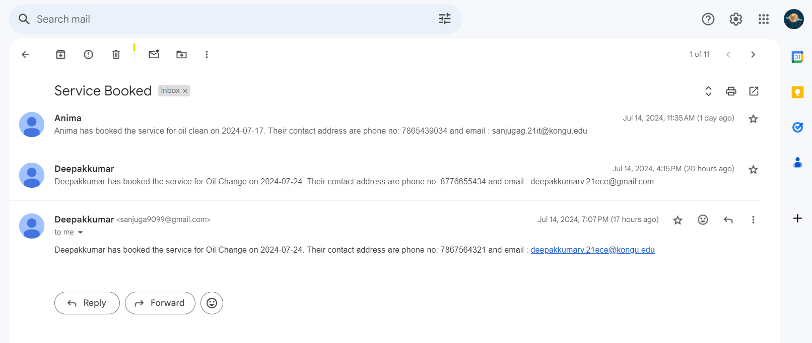
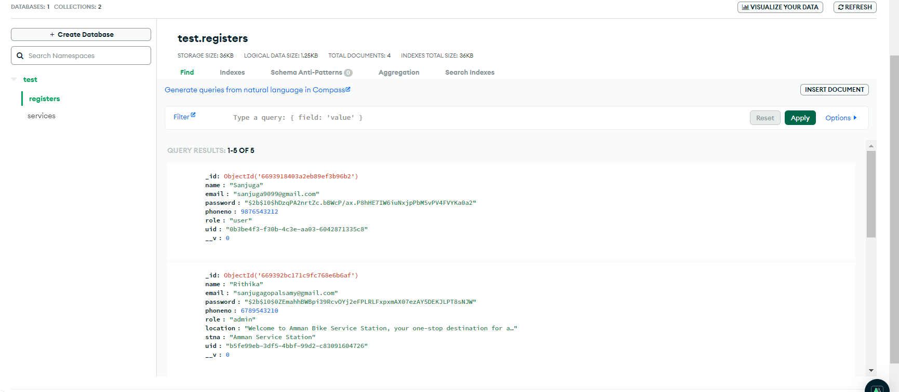
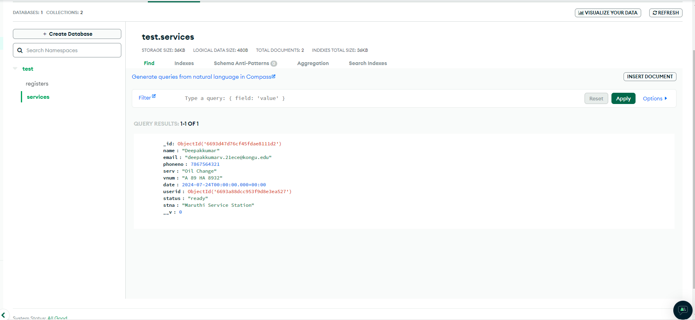

## Name: 
    Bike Service website:

## Tech Stack:
    Reactjs, Nodejs, mongodb

## Steps to Run this Project:

    1. Clone this repository( git clone url)
    2. In the console run the command( npm install )

## To run backend

    1. cd backend
    2. nodemon index.js

## To run frontend

    1. npm start

## To run json file

    1. cd backend
    2. npx json-server -p 8002 -w data.json

Run the frontend, backend and json file concurrently in different Terminal

backend file - backend file contains all the api based logics
FrontEnd file - It contains the structure and the css of the UI
Json file - It is for storing category based information

## Schema Details

1.  UserDetails:

        Role: "Admin"
            Manages user and service provider's details

        Role: "service provider"
            name
            email
            password
            phoneno
            role
            location
            station name
            description
            uid

        Role: "user"
            name
            email
            password
            phoneno
            role
            uid

2.  Services:

        name
        email
        phoneno
        services
        vehicle number
        date
        userid
        status
        station name

3.Category: -> Stored as a json file

    cname
    description
    location
    adminUid
    stationName

### sample data:

Only one admin is there.That admin's credentials are given:
email: hansi@gmail.com
pass : Hansi@1234

Anyone can register as a service provider and add their services
This is one of the already existing admin login credentials
admin login:
email: ravinac.21it@kongu.edu
pass : ravina@9099

Anyone can register can user and book their required services
This is one of the already existing user login credentials
user login:
email:deepakkumarv.21ece@kongu.edu
pass : deepak@9099

service providers receives the mail while the user books the services:
Sample photo:

## Schema Images:

Register:

Service:

Some Functions:

Jwt is used for handling sessions and Role based access

    Admin can only move to the admin's page to manage the user and service provider's details.
    Service provider can only add new services and manages orders
    User's can't able to visit the service provider's page (the session is handled). The user can only book services and see their booking and can track their bookings.
    
Authentication systems are also provided like register, login and logout.
